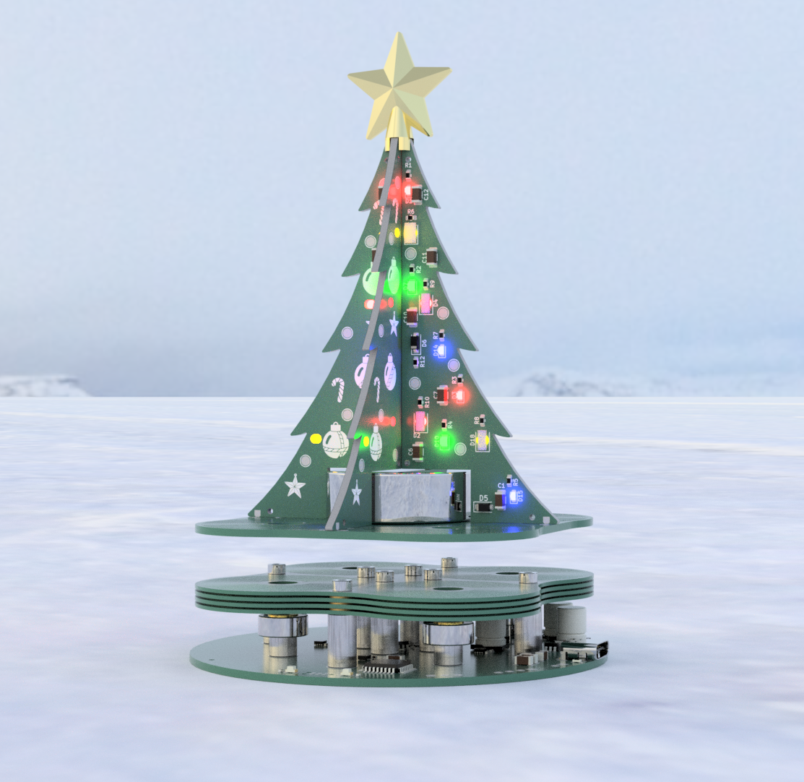
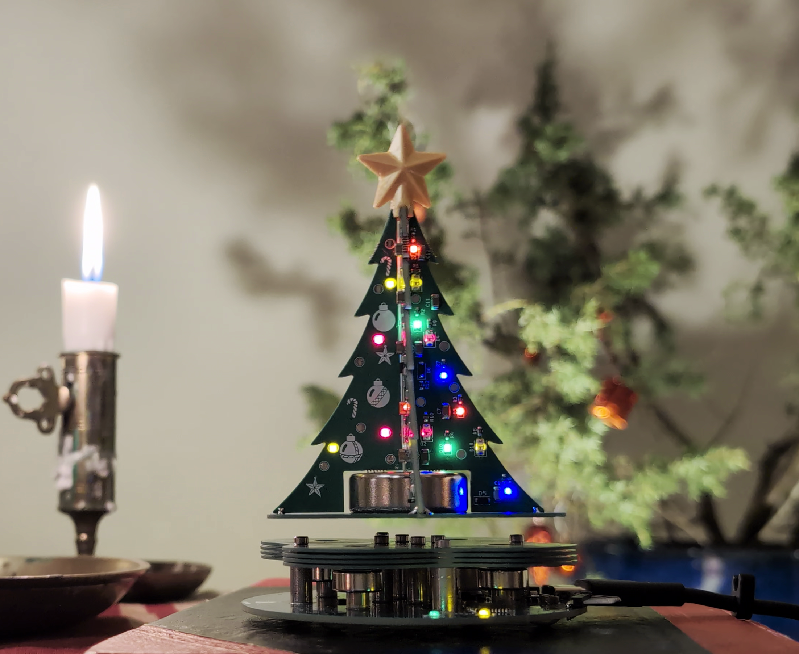
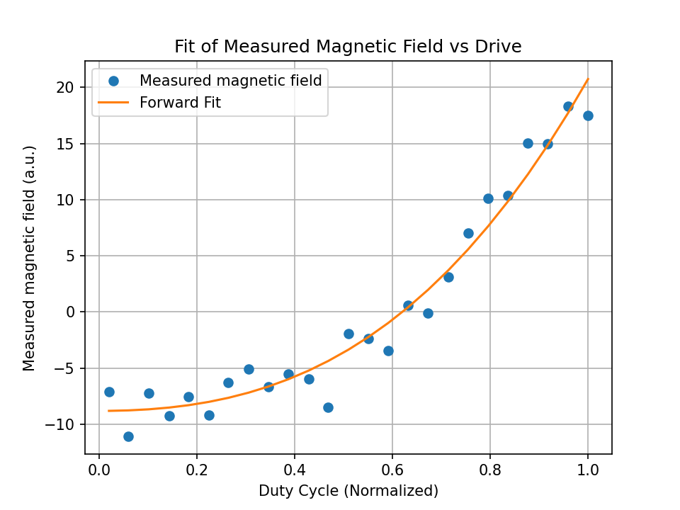
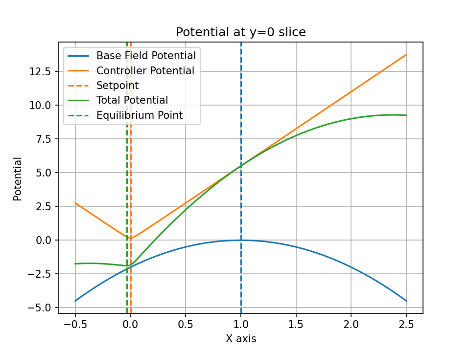
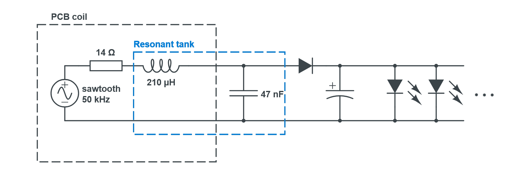
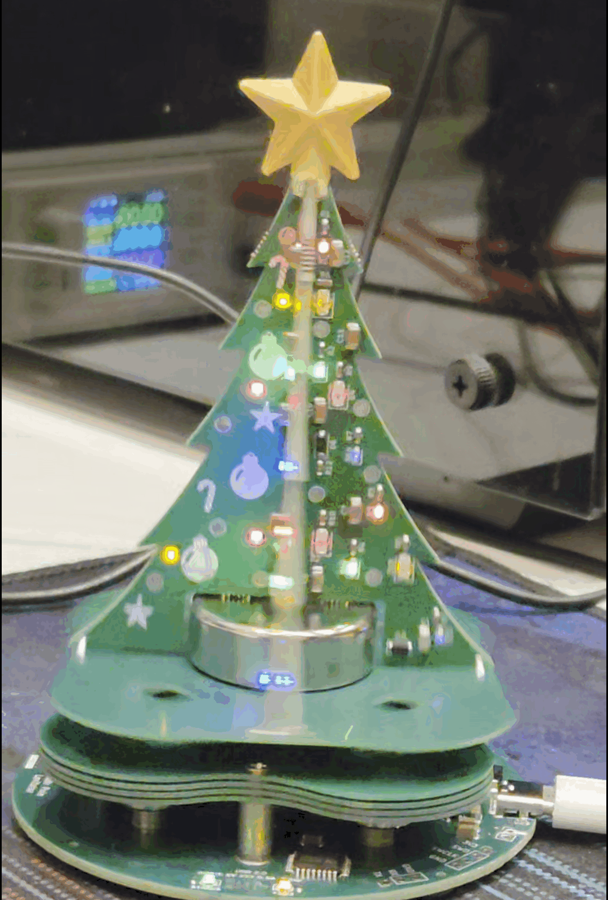
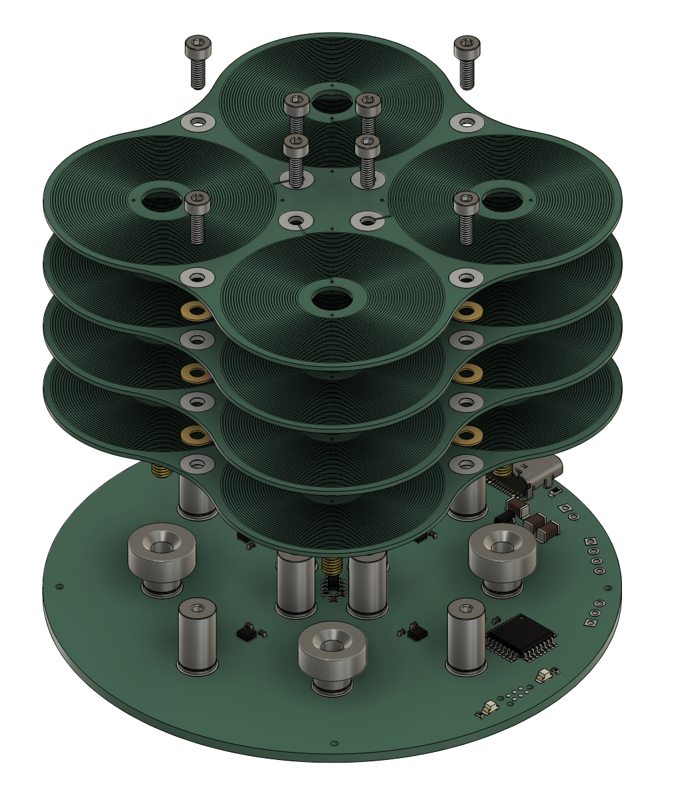
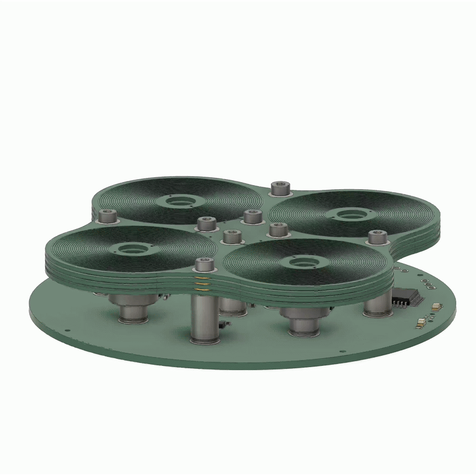
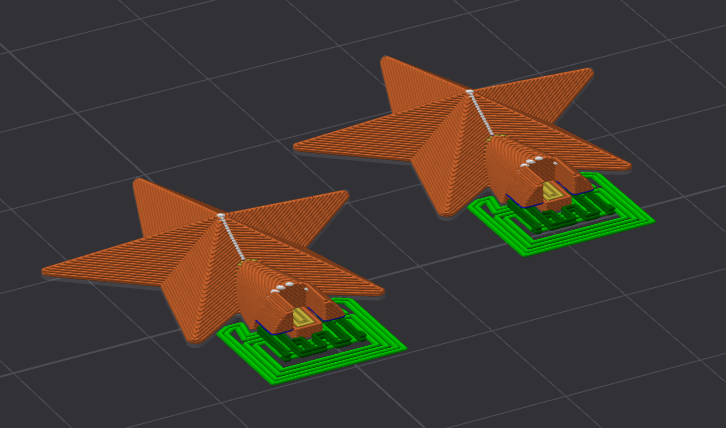

# South Pole Levitator

Janky Jingle Crew is back this Christmas as well! We are continuing with the theme of magnetic propulsion from last year, but this time for levitation! 

## Background
Magnetic levitation kits have been around for a long time, but most of them are analog designs running on 12 V. A more recent 5 V digital version by [Jonathan Lock](https://gitlab.com/e4870/maglev/-/tree/main) caught our attention and served as a big source of inspiration for this project. Our take focuses on lowering the BOM cost and making assembly easier by replacing traditional coils with PCB coils.

We were aiming to build a batch of around 50 units, so coil winding quickly became a bottleneck. That led us to PCB coils as a more scalable solution. Mounting the coils was another pain point, gluing them down and then soldering wires (like many existing kits do) felt messy. Instead, we combined the mounting and electrical connection using solderable standoffs.

We also made a (slightly unnecessary) optimization on the microcontroller side. To reduce BOM cost slightly, we chose the STM32G030, which doesn’t have an FPU, and planned to implement all control algorithms using fixed-point math. In hindsight, the time spent probably outweighed the cost savings, but at least we learned a lot about fixed-point math (and wrote terrible code) along the way.

The final result is shown below: a fully functional magnetic levitation platform made entirely from PCBs. Even the levitating tree is a PCB. Overall, the project turned out well, although there are plenty of things that could still be improved. Feel free to open an issue or mail us if you have any technical questions.

<!--  -->

## User Guide

The card needs to be powered with a 5V power supply over USB-C, capable of at least 500 mA.

To levitate the tree:

1. Place the tree away from the driver board.
2. Place the driver board on a flat, nonmagnetic surface, and plug in the USB-C cable. Note that the board needs to be level when it gets power for the correct calibration. If the tree is too close, this will also affect the calibration. The calibration is complete once you hear a short beep from the coils. The status LED should also start blinking.
3. Hold the tree a few centimeters over and lower it slowly, trying to keep it centered and pointed straight up.
4. The rest is a balance between keeping the tree centered, and holding it with a loose enough grip. The tree needs to have the freedom to find the center itself, while also being prevented from sticking to either of the four base magnets.

It is also possible to play some Christmas tunes. Simply turn the driver board upside down and place the tree on top of it. The coils should start playing a random assortment of Christmas tunes.

## Working principle

### Magnetic levitation
The levitation is generated by four PCB coils but also four neodymium magnets. The base magnets provide the majority of the force required for levitation while the coils only generate a small corrective force required to keep the magnet in a stable position (Earnshaw's theorem). 

Each coil can be driven independently, but we chose to split the coils into two pairs (X & Y) and drive them with opposite polarity.

A 3D Hall effect sensor TMAG5273 was used to sense the position of the levitating magnet and drive the coils accordingly.

### Control

At the core the control algorithm is a PD controller controlling the duty cycle of the coil drivers in order to keep the levitating magnet centered in the X and Y direction. The position is not directly measured, instead the magnetic field strength in the X and Y direction is used as a proxy for position. This is not linear with the actual position, but is approximated as linear close to the center. This is the general idea but there are multiple problems that need to be handled for stable levitation:
<!-- - Non-linear relation between coil driver duty cycle and generated magnetic field. -->
<!-- - Non-linear coil driver characteristics. -->
<!-- - Coupling between coil current and measured magnetic field. -->
<!-- - Setpoint calibration. -->

<!-- #### Non-linear coil driver characteristics. -->

 Non-linear coil driver characteristics 

We observed a non linear relation between the coil driver duty cycle and the output current which can be seen in the figure below. To correct for this we wanted to measure the coil current as a function of duty cycle. Since coil current is proportional to the generated magnetic field we can measure the strength of the magnetic field for different duty cycles with the hall sensor. From this a quadratic fit was made which is used to linearize the coil driver response in the control algorithm.

<!-- #### Coil coupling compensation -->

 Coupling between coil current and measured magnetic field 

When driving the coils, the generated magnetic field affects the hall sensor measurements. This is problematic since this is added to the field from the levitating magnet and affects the position measurement. Since the position measurement is used as the input to the controller this creates a feedback loop which can lead to instability and oscillations. To compensate for this an feedforward model of the generated magnetic field from the coil current is subtracted from the hall sensor measurements before they are used in the controller. This model is created by measuring the magnetic field from each coil at different duty cycles while there is no levitating magnet present. A linear fit is then made to get the coupling coefficients for each coil. This is done during the initialization of the system.

<!-- #### Setpoint calibration -->

 Setpoint calibration 

Due to manufacturing tolerances in the placement of the hall sensor and the base magnets, the center of the base magnetic field, which is the optimal place to levitate the magnet, does not necessarily correspond to above the hall sensor. This means that the setpoint for the controller has to be calibrated for each unit.

In the figure above, an illustrative example of the magnetic potential from the base magnets and the proportional part of the PD controller is shown. The blue curve represents the potential from the base magnets, which has a unstable equilibrium point at $x_{base}=1$. The orange curve represents the potential from the proportional part of the controller, which is centered around the setpoint at $x_{setpoint} = 0$. The total potential is the sum of these two potentials, shown in green, which has a stable equilibrium point close to but not exactly at the setpoint. Due to the slope of the base potential at the setpoint, the equilibrium point will be offset the setpoint away from the base magnet center. By calculating this difference $x_{delta} = x_{equilibrium} - x_{setpoint}$ we can then adjust the setpoint $x_{setpoint,new} = x_{setpoint} + \alpha x_{delta}$ to move the equilibrium point closer to the setpoint. This process is repeated every control loop and will lead to the setpoint converging to the base magnet center.

### Driving LEDs wirelessly

The LEDs on the tree are powered by electro-magnetic noise from the switching ripple of the coils on the driver board. There are four PCB coils in the base of the tree, each powering its quarter. The induced AC voltage in each of these coils is amplified with a resonant LC-tank tuned to the switching frequency. The resonance circuit consists of the inductance in the PCB coil and a separate MLCC C0G capacitor on the tree quarter. This amplified waveform is then rectified with a single Schottky diode, finally driving the LEDs. The power transfer efficiency is absolutely garbage and therefore the LEDs will only light up when the coils are aligned. However, this also gives a passive blinking/strobing effect when it spins (without any additional components)! Definitely a planned feature and not a design flaw....

## Design
The whole levitator can be split into two main parts. The platform base and the levitating tree. The platform base consists of two different PCB designs, one driver PCB and four coil PCBs (4x).

### Driver board
The driver board has all the components mounted. There are a total of 12 standoffs: 8x M2 standoffs for mounting the coil board and 4x M3 standoffs for mounting the base magnets. An STM32G030 reads the XYZ magnetic fields from the TMAG5273 and controls 4x DRV8837 drivers for the coils. Power is provided by USB-C connector. A TagConnect TC2030 along with pin headers break out the SWD pins for debugging.

### Coil board
The coil board consists of four spiral coils with ~116 turns and 0.245mm trace width (25 turns per layer, 4-layer PCB, outer 1 oz, inner 1 oz). The resulting coil resistance turns out to be around 20 Ohm. Therefore, 4x coils are connected in parallel to enable higher coil current and also increase efficiency slightly. Brass washers are placed in-between each coil board to ensure electrical contact all the way down to the driver board. Initially a coil with 100 turns and 0.3mm trace width was used (outer 1 oz, inner 0.5 oz). This worked fine as well and 0.5oz is way cheaper. You can use either one, although the code might be slightly more tuned for the 116 turns variant, it should still work with the cheaper 100 turns variant.

### Tree
The tree consists of 5 PCBs, four of which constitute the tree itself, and one being the base plate with the pickup coils. A 3D-printed star keeps all of the tree-PCBs connected at the top! Tip: blow on one side of the tree when it is levitating to make it spin!

## Manufacturing
All the manufacturing files for the PCBs and the final software can be found in this repository. 

Upload these to your favorite PCB manufacturer and order the boards. We designed the boards with JLCPCBs preexisting Parts Lib and used their PCBA due to time constraints. However, PCBWay and NextPCB probably have these components in stock as well or can source them for you.

You will also need the following materials per unit:
- 1x Levitation magnet (N35-N45 30mm diameter, 10mm height) 
- 4x Ring magnets with M3 countersunk hole (N35-N45, 12mm diameter, 5mm height)
- 8x Non-magnetic M2 screws 8mm
- 4x Non-magnetic M3 countersunk screws 8mm
- 24x M2 Brass washers 4-5mm OD (steel probably works as well, slightly worse conductivity).
- 8x Rubber feet (at least 0.4mm height)

## Assembly

### Driver board

### Tree

To begin with, the star is 3D-printed. You can either use the half-star variant (recommended) or the whole-star variant. For the half-star, print two of them laying flat and with support activated. The halves can then be glued together with superglue. Alternatively, the whole-star variant can be printed standing up depending on how well your printer handles overhang and/or surface finishes over supports.

To keep the magnet centered, and the parts of the tree perpendicular to the base, a 3D-printed jig was used. This is not necessary, but drastically reduces the time to assemble multiple trees. If you are only making one, don't bother printing out the jig.

Both the magnet and the star can be glued with e.g. superglue or epoxy. Note that the magnet orientation matters!

The four "quarters" of the tree are soldered onto the base PCB with two solder joints each. These joints are the PCB coil A & B. We recommend gluing the star before soldering!

## FAQ

### How do I reproduce this?
PCB assembly files can be found in /production for the driver board and tree in their respective folders under PCB/. 
Gerber files for both coil boards are found in /gerber in their respective folders under PCB/. Remember to choose 1oz inner layers if you go for 116 turns variant.
Upload to your PCB manufacture of choice (JLCPCB, PCBWay, NextPCB).
Print the star. Buy magnets and screws. Assemble.

#### Flashing
An STLink, Segger Jlink or similar is required to flash the driver board. Some type of 6 pin (2x3 1.27mm pitch) pogo connector is also required (we use a TagConnect TC2030NL).
Or you can use the through hole SWD pins. A compiled binary is provided in SW/release if you don't want to go through the hassle of compiling yourself because the makefile is a bit of mess currently. It's written for a Windows filesystem but uses unix commands (we used msys2 or cmder to compile). Next project will probably use cmake to avoid these problems.

### How much did this all cost?
This year's project was quite expensive. Even with a big batch of 50 units, the unit cost was around 40-50 EUR. PCBs alone cost 20 EUR per unit. Magnets and screws were not cheap either.
Expect to spend quite a bit if you are planning on reproducing it, especially a small batch. 

## Acknowledgements
Special thanks to Jonathan Lock, this project was heavily inspired by his well-documented [maglev build](https://gitlab.com/e4870/maglev/-/tree/main).

Also thanks to Seth.K and his [coil generator plugin for KiCAD](https://github.com/SK-Electronics-Consulting/kicad-coil-generators). 

## Credits
The Janky Jingle Crew 2025 consists of:

 - [Daniel Quach](https://github.com/BasementCircuits): Project lead, PCB, Firmware
 - [Johan Wheeler](https://github.com/johanwheeler): Firmware, Control
 - [Gustav Abrahamsson](https://github.com/GustavAbrahamsson): PCB, Mechanical
 - [Adam Anderson](https://github.com/adaand00): Firmware

